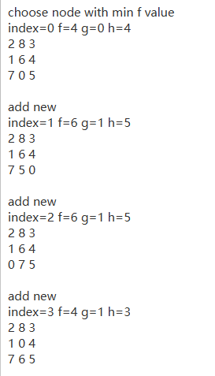

# 运行方法

```sh
java -jar Astar.jar
```


# 代码框架

- package `Astar` ：定义A*搜索的基本框架
  - interface `SimpleState` ：A*搜索的基本节点的状态
  - abstract class `SimpleNode<State extends SimpleState>`：A*搜索的基本节点，包括状态、索引、父节点索引、f/g/h评估值
  - abstract class `Astar<Node extends SimpleNode>` ：A*搜索的基本实现，子类要重载 `h` 函数

- package `EightPuzzle` ：八数码问题的具体实现
  - class `EPState implements SimpleState` ：八数码问题的节点状态，即数码摆放情况
  - class `EPNode extends SimpleNode<EPState>` ：八数码问题的节点
  - package `Search1` 
    - class `EP1Search extends Astar<EPNode>` ：使用h1函数的八数码A*搜索，重写 `h` 函数为返回放错位置的码个数
  - package `Search2` 
    - class `EP2Search extends Astar<EPNode>` ：使用h2函数的八数码A*搜索，重写 `h` 函数为返回0
  - class `EPController` ：UI控制类


# 问题回答

**验证凡A\*算法挑选出来求后继的点 n ，必定满足：f(n) ≤  f\*(S0)。**

f\*(S0)即为最佳路径的长度。

由运行结果可见，挑选出来求后继的点 n 的 f(n) 都满足 f(n) ≤  f\*(S0) 。


**验证 h1(n) 的单调性，显示凡A*算法挑选出来求后继的点 ni 扩展的一个子结点 nj ，检查是否满足:
h(ni) ≤ 1+h(nj)。**

由运行结果可见，挑选出来求后继的点 ni 扩展的一个子结点 nj 都满足 h(ni) ≤ 1+h(nj) 。



**如果将空格看作0，即九数码问题，利用相似的启发函数h1(n)和h2(n)，求解相同的问题的搜索图是否相同？**

这要看九数码的最终状态的定义。如果最终状态是：

1 2 3

8 0 4

7 6 5

那么搜索图是相同的，否则搜索图必然有差异。


**写出能否达到目标状态的判断方法。**

open表为0而未求得解，搜索失败，即达不到目标状态。